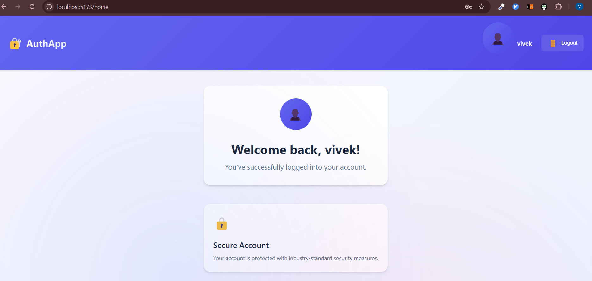
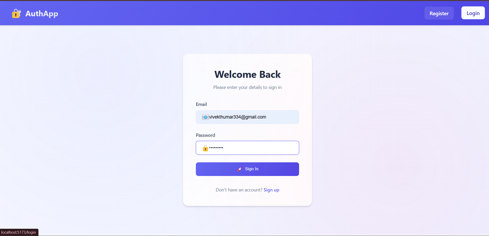
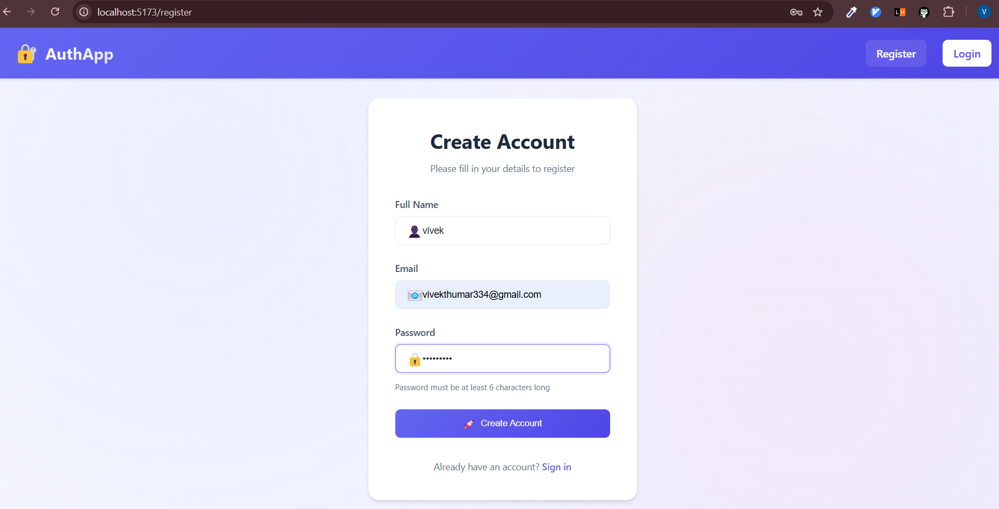

# 🔐 Authentication

A secure and scalable user authentication system built using the **MERN stack**. This project provides comprehensive user management with registration, login, and session handling control through an elegant frontend and a robust backend API.


## 📸 Screenshots

### 🏠 Home / Landing Page


### 🔑 Login Page


### 🧾 Register Page



## 📝 API Documentation

| **Endpoint**            | **Method** |   **Description**      | **Auth Required** |
|-------------------------|------------|------------------------|-------------------|
| `/api/auth/register`    | `POST`     | Register a new user    | No                |
| `/api/auth/login`       | `POST`     | Authenticate user      | No                |
| `/api/users/home`       | `GET`      | User profile           | Yes               |


## 📝 Description

This application delivers a complete full-stack implementation of user authentication using React for the frontend and Node.js/Express with MongoDB on the backend. It features secure login and registration flows. The frontend utilizes custom CSS styling to ensure a responsive, intuitive, and visually appealing user interface across all devices.

## 🛠️ Tech Stack

| Frontend | Backend | Database | Tools   |
|----------|---------|----------|---------|
| React    | Node.js | MongoDB  | Vite    |
| Vite     | Express |          | Dotenv  |
| CSS      |         |          | Postman |

## 🌟 Features

- ✅ User registration with email verification
- ✅ Comprehensive form validation with real-time feedback
- ✅ Password encryption using bcrypt
- ✅ Protected API routes and frontend pages
- ✅ Intelligent redirects based on authentication status
- ✅ Responsive design with custom CSS
- ✅ Session persistence

## 📁 Project Structure

```
authentication/
├── client/                  # React Frontend
│   ├── public/
│   ├── src/
│   │   ├── components/      # Reusable UI components
│   │   ├── pages/           # Main application pages
│   │   ├── App.jsx          # Main application component
│   │   └── main.jsx         # Entry point
│   ├── index.html
│   ├── vite.config.js
│   └── package.json
│
├── server/                  # Node.js + Express Backend
│   ├── controllers/         # Route controllers
│   ├── helpers/             # Utility functions
│   ├── models/              # MongoDB schemas
│   ├── routes/              # API route definitions
│   ├── index.js             # Server entry point
│   └── package.json
│
├── screenshots/             # README screenshots
│   ├── home.png
│   ├── login.png
│   ├── register.png
│   └── logout.png
│
├── .gitignore
├── README.md

## ⚙️ Setup Instructions

### Prerequisites

- Node.js (v14+ recommended)
- npm or yarn
- MongoDB (local installation or MongoDB Atlas account)

### Installation

```bash
# Clone the repository
git clone https://github.com/mrvivekthumar/MinorProject_1_Authentication.git
cd MinorProject_1_Authentication.git

# Install frontend dependencies
cd client
npm install

# Install backend dependencies
cd ../server
npm install
```

### Environment Configuration

Create a `.env` file in the `/server` directory:

```env
MONGO_URI=your_mongodb_connection_string
```

### Running the Application

```bash
# Start the backend server (from /server directory)
npm run dev

# Start the frontend application (from /client directory)
npm run dev
```

Access the application at: http://localhost:5173


Made with ❤️ by [vivek Thumar](https://github.com/mrvivekthumar)